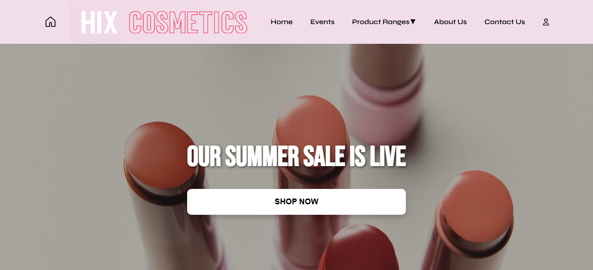
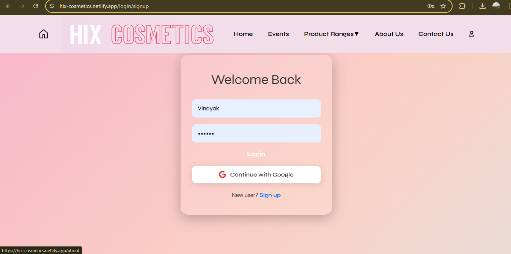
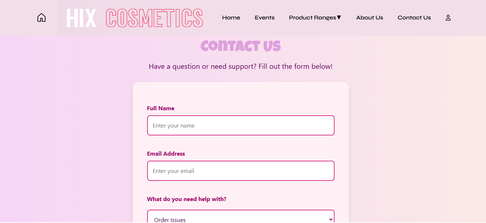
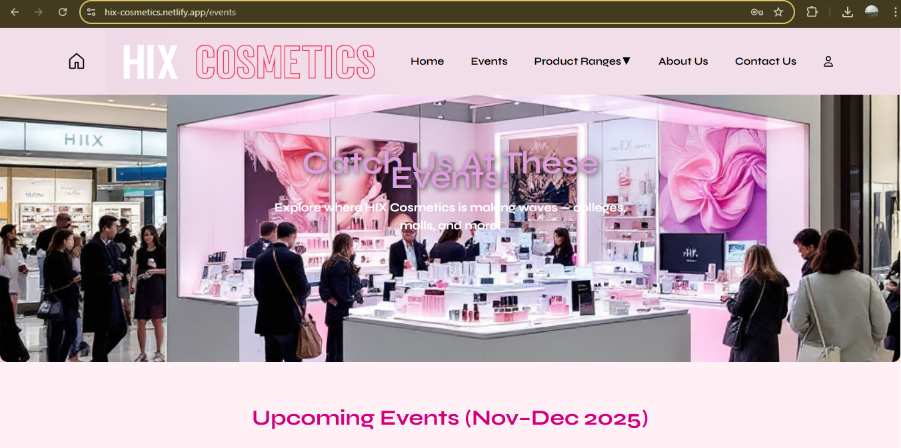

# 💄 HIX Cosmetics

A modern, responsive web application for a fictional cosmetics brand — showcasing a clean UI, authentication, product sections, and animated elements. Built using **React**, **Firebase**, and **CSS/Chakra UI**.

🔗 **Live Demo:** [https://hix-cosmetics.netlify.app](https://hix-cosmetics.netlify.app)

---

## 🚀 Features

- 🔐 **Firebase Auth**: Email/password login, signup, and secure authentication
- 🖼️ **Product Showcase**: Clean layout for displaying products
- 📅 **Events Page**: Highlights upcoming campaigns with animation effects
- 📬 **Contact Form**: Firebase-linked form for customer inquiries
- 🎨 **CSS Animations**: Keyframe-based transitions and subtle visual effects
- 🌙 Light/Dark support via Chakra UI

---

## 🛠️ Tech Stack

- **React.js**
- **Firebase (Auth & Firestore)**
- **Chakra UI**
- **CSS3**
- **Netlify** (for deployment)

---

## 📸 Screenshots

### 🏠 Home Page

### 🔐 Auth Page

### 📬 Contact Page

### 📅 Events Page

---

## 📁 Folder Structure

---

## 👨‍💻 Developer

**Vinayak Singh**  
React enthusiast | DOM Specialist | Full-Stack Web Developer  
📧 vinayaksinghforyou@gmail.com  
🔗 [LinkedIn](https://www.linkedin.com/in/vinayak-singh-8ab2442ab)

---

> 🚧 This project is actively maintained and open for collaboration!
